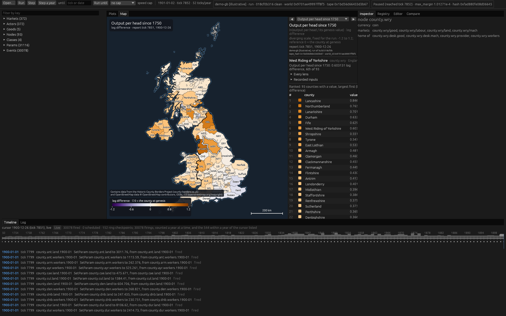

# rustyecon

rustyecon runs 300 years of economic history, 1750–2050, as an agent economy in a
granular world. History is scored against the record from 1750 to 2025; from 2025 to
2050 the engine runs forward branches.

Every decision an agent makes is one of the margins of the pinning paper (*Pinning the
Wage to Scarcity and Technology*): producers choose between people and machines task by
task, machine makers sell machine-hours at what their inputs cost them, land and sites
rent for what their users pay, and households choose between work and a life outside
it. Nothing is solved centrally. Agents read posted prices and their own state, and
markets clear by rationing. A separate equilibrium solver, the oracle, computes where the
economy must settle when history stands still, and the agents are tested against it.

What it is for, in order:

1. Generate the long record for England and the UK, 1750–2025, from one set of
   parameters.
2. Run the forward branches, 2025–2050, from a certified 2025 state.
3. Run the policy lab: a rent tax with a uniform transfer, a consumption gate tax,
   payroll and income taxes, Poor Law regimes, and historical counterfactuals.
4. Explain.

## Status

Phase 0, the reboot, is done: both its sessions are closed and its gate is green (see
[STATE.md](STATE.md)). The second session built the certification stack
([docs/CERTIFY.md](docs/CERTIFY.md)): dated criteria, sealed verdict-first certificates, the
run's manifest and Parquet telemetry. The gate world and the Appendix B world both certify PASS,
and their certificates are in `results/`. A Phase 2 probe found that agents at the paper's
margins reach the oracle's equilibrium of the SSRN Appendix B economy
([docs/probe/REPORT.md](docs/probe/REPORT.md)). Phase 1, the oracle, is closed (P1.14): units 1a
to 1f have landed, among them 1d (worker types and the wall), 1e (parcels, the idle margin and
the priced exit s(q)) and 1f (households and government), and PLAN Phase 1's gate is met item by
item ([crates/oracle/README.md](crates/oracle/README.md)). On branch `oracle-goods` (2026-09-27,
P1g.1–P1g.7) the oracle gained unit 1g, machines as goods: durable goods built from and run on
goods, productivity checked per period (D-G10), a chain of goods mapped to unit 1c, and plants as
machine types ([crates/oracle/docs/unit-1g.md](crates/oracle/docs/unit-1g.md)), verified with one
fix round (P1g.6). On branch `phase2-goods` (2026-09-28, P2.2.1–P2.2.4) the stocks probe put the
horse into the engine as a durable good, bred by a maker and hired out by a wet capacity desk,
and found unit 1g's equilibrium from displaced prices, costs, stocks and coins: GO for stage
v2a.1 at 52 ticks a year ([docs/probe/HORSES.md](docs/probe/HORSES.md)). The GUI is designed
([docs/GUI.md](docs/GUI.md)), and its shell, G0, is closed: G0.1, the viewer, and G0.2, the
editor (see "Running the GUI" below). G1, the oracle lab, is built on branch `g1` (2026-09-27,
G1.1–G1.10, and verified once, its findings fixed at G1.11): the oracle's units 1a–1f solved
beside their goldens, the price-step explainer, log axes, a watchlist, event and date breakpoints
and snapshots, with its window checked by hand still to come. On branch `demo-world` (2026-09-27,
D.1–D.5), the GUI's county map and its lenses came forward over an illustrative world of the
United Kingdom's 93 historic counties, 1750–1901 (see "The demo world's map" below). The crates
fill in phase by phase:

| Crate | What it holds | Fills in |
|---|---|---|
| `crates/core` | ids and keys, goods, the clock and time units, inventories, deltas, state, the conservation ledger, the state hash, checkpoints, the tape's schema and runtime form, the `libm`-backed maths | Phase 0 |
| `crates/markets` | orders and admission, clearing, settlement, the price update | Phase 0 |
| `crates/agents` | the behaviour seam and the scripted actor; the agent rules | Phase 0; rules in Phase 2 (the probe's four Appendix B roles since P2.0.1, four many-market roles since P2.1.1, and three stock roles since P2.2.1) |
| `crates/engine` | `Sim`: the tick loop, checkpoints, resume, the replay audit, the read-only per-tick report a frontend drives and reads | Phase 0 |
| `crates/cli` | the `rustyecon` binary (`run`, `resume`, `replay`, `registry`, `certify`, `worldgen`, `licences`): arguments, files, exit codes, the build stamp | Phase 0 |
| `crates/certify` | dated criteria, the batteries and the kick check, sealed certificates, the run's manifest, and Parquet telemetry behind the feature `parquet` ([docs/CERTIFY.md](docs/CERTIFY.md)) | Phase 0, second session |
| `crates/oracle` | the equilibrium solver (library `oracle`): unit 1a, one category with durability and interest, reproduces the SSRN Appendix B; 1b adds many categories and the fork, 1c many machine types and the Leontief inverse, 1d worker types and the wall, 1e parcels, the idle margin and the priced exit, 1f households and government, 1g machines as goods ([its README](crates/oracle/README.md)) | Phase 1: 1a–1f landed, closed at P1.14; 1g on `oracle-goods` (P1g) |
| `crates/worldgen` | the tape compiler: the county atlas (D.1), and a first compiler for the illustrative demo world, `worlds/demo-gb` ([docs/demo/WORLD.md](docs/demo/WORLD.md), D.2), and that world's lens measures, which the GUI's map shows (D.3) | Phase 4; the demo world's form on branch `demo-world` |
| `crates/probe` | the Phase 2 probe's harness: the Appendix B tape's generator, named perturbations, per-tick observables against the oracle ([docs/probe/RULES.md](docs/probe/RULES.md)); its oracle-free measures are certify's; the markets probe's harness, tapes and kick sets ([docs/probe/MARKETS-RULES.md](docs/probe/MARKETS-RULES.md)); the stocks probe's ([docs/probe/HORSES-RULES.md](docs/probe/HORSES-RULES.md)); the loop step's, rule B with CAPACITY's plants ([docs/probe/LOOPS-RULES.md](docs/probe/LOOPS-RULES.md)) | the probe, P2.0.1; the markets probe, P2.1.1; the stocks probe, P2.2.1; the loop step, P2.2b.2 |
| `crates/gui` | the interactive frontend, in egui: live runs, plots, lenses, the tape editor, a county map, and the oracle lab ([docs/GUI.md](docs/GUI.md)); the binary `rustyecon-gui` | from G0, after Phase 0's second session; one stage beside each phase (G0 closed at G0.3; G1 built on `g1`) |

Packages are named `rustyecon-<crate>`. `tapes/gate.ron` is the Phase 0 gate world,
`tapes/appb.ron` the probe's Appendix B world, `tapes/markets-<id>.ron` the markets probe's
worlds, `tapes/horses-<id>.ron` the stocks probe's, `tapes/loops-<id>.ron` the loop step's
(rule B with CAPACITY's plants, P2.2b), and `tapes/demo-gb.ron` the illustrative
demo world, 93 historic counties of the United Kingdom from 1750 to 1901, compiled by
`rustyecon worldgen worlds/demo-gb --out tapes/demo-gb.ron`; nothing from it may be scored or
cited (`certify` seals any run of it UNSCORED; citation is kept out by hand). The county atlas
in `data/atlas/` is under the ODbL 1.0, with its own LICENSE and ATTRIBUTION, which
`rustyecon licences` and `rustyecon-gui --licences` print. `criteria/` holds each tape's dated
criteria, registered before its first certified run, and `results/` the certificates and
manifests they gave.

## Documents

- [STATE.md](STATE.md): the resume point. Where things stand, the decisions open to veto,
  and the next steps in order.
- [docs/PLAN.md](docs/PLAN.md): the plan, amended by the addendum's rulings, A14 among them.
  Architecture, the standing rules R1–R16, the phases and their gates, and the GUI's stages
  beside them.
- [docs/ENGINE.md](docs/ENGINE.md): the Phase 0 engine contract, with each step's
  amendments.
- [docs/CERTIFY.md](docs/CERTIFY.md): the Phase 0 session 2 contract, with each step's
  amendments: certification, the manifest, telemetry and the GUI's engine asks.
- [docs/TAPE.md](docs/TAPE.md): the tape's schema, with the gate tape as its example.
- [docs/probe/](docs/probe/): the Phase 2 probe's rules (RULES.md) and report (REPORT.md), and
  the markets probe's rules (MARKETS-RULES.md) and report (MARKETS.md), and the stocks probe's
  rules (HORSES-RULES.md) and report (HORSES.md).
- [docs/spine/](docs/spine/): the data spine's notes (DATA_NOTES.md) and Breakpoint B's
  pre-look (EYEBALL.md).
- [docs/GUI.md](docs/GUI.md): the GUI's design (A14): its rules, architecture, panels, editor,
  map and roadmap, with its review ledger in `docs/reboot/`.
- [docs/reboot/REVIEW.md](docs/reboot/REVIEW.md): the review of the repository at the
  reboot, with the rulings made after it.
- [docs/reboot/ADDENDUM.md](docs/reboot/ADDENDUM.md): what the review missed (the July
  branches), with the rulings on amendments A1–A14.
- [docs/timeline/eras.md](docs/timeline/eras.md): era research that feeds worldgen.

## Build and test

`rust-toolchain.toml` pins Rust 1.97.1 with rustfmt and clippy; rustup installs it on
first use. The gates ask for zero warnings, a clean clippy and clean formatting on both
machines.

WSL Ubuntu is the primary build machine, and the gates run there. `scripts/gate.sh` runs
the whole gate with the build directory outside the tree: formatting, clippy, the tests,
the repeat-hash test by name, certify without Parquet, two runs of the gate tape through
the binary, whose hash streams must agree, the build stamp, the committed certificates
recomputed, the probe's report pinned, and telemetry written from two processes. Its
header lists each step. From a Windows shell:

```sh
wsl -d ubuntu --exec bash -lc '/mnt/c/<path to the repository>/scripts/gate.sh'
```

Use `--exec`: with a plain `--` the exit code is lost. Its main steps by hand, and a
certified run:

```sh
cargo fmt --all --check
cargo clippy --workspace --exclude rustyecon-gui --all-targets -- -D warnings
cargo test --workspace --exclude rustyecon-gui --release
cargo run --release -p rustyecon-cli -- run tapes/gate.ron --until 2080
cargo run --release -p rustyecon-cli -- certify tapes/gate.ron \
    --criteria criteria/gate-2026-09-26.ron --out <dir>
```

`certify` writes the certificate, the manifest and the hash file, prints the verdict
first, and exits 0 only on PASS.

Windows is the secondary check: the same script under Git Bash. Hash equality between the
two platforms is recorded in STATE.md, not gated. `.github/workflows/ci.yml` runs
`scripts/gate.sh` on GitHub's Ubuntu runner; it runs only once the branch is pushed.

The GUI never gates engine work (docs/GUI.md, D1): the workspace's default members leave
`crates/gui` out, and `scripts/gate.sh` excludes it from clippy and the tests and checks it
once without gating. `scripts/gui.sh` is the GUI's own gate, run at each of its stages:
formatting, clippy, its tests in release with 87 of them checked by name and, on Linux, G1's
sweep measurement, and the GUI's hashes of the gate, Appendix B and demo worlds and of two
edited branches against the cli's.
It runs as the gate does:

```sh
wsl -d ubuntu --exec bash -lc '/mnt/c/<path to the repository>/scripts/gui.sh'
```

`clippy.toml` enforces two standing rules: no std hash containers (R8, no unordered
iteration on the delta path), and no platform transcendentals (`exp`, `ln`, `powf` and
the rest go through one module backed by the `libm` crate; `mul_add` is banned too).

## Running the GUI

`rustyecon-gui` is the interactive frontend ([docs/GUI.md](docs/GUI.md)). Its shell, G0, is
built: it runs a tape live, plots any recorded series, inspects markets, actors, params and
events, edits the tape into branches, compares a branch with its parent, and exports. It is not
a default member, so build it by name, with the build directory outside the tree. On Windows,
where the window is checked, in PowerShell from the repository:

```powershell
$env:CARGO_TARGET_DIR = 'D:/rustyecon-targets/gui'
cargo run --release -p rustyecon-gui -- tapes/gate.ron
```

Elsewhere, `cargo run --release -p rustyecon-gui -- tapes/gate.ron` with a display. With no tape
it reopens the tapes of the last session, and the toolbar's Open picks another.

- **Run.** The tape opens paused at tick 0 with every price plotted. Space runs and pauses,
  `.` steps one tick, and the toolbar steps a year, runs until a tick or a date, and caps the
  speed. By default the run pauses on an error, with its ledger line.
- **Look.** The outliner lists the tape's entities by key; select one to inspect it, or plot
  its series. The plots stack one panel per unit. The timeline shows the cursor, the events
  and the checkpoints; the registry lists every param with its uses and basis; the log lists
  loads, runs, pauses, fired events, rationing onsets and errors.
- **Edit.** In the Editor tab, mint a key, give a date, type the act as the tape writes it,
  for example `SetParam(param: "mine.capacity", to: "mine.capacity.base")`, write a note, Add
  edit, then Apply. The branch resumes from its parent's last matching checkpoint, or reruns
  from genesis and says why. Each entry it adds or changes is stamped
  `Assumed("GUI experiment <date>: <note>")`, and its name carries the marker
  `[GUI experiment <date>]`.
- **Compare and export.** The Compare tab shows a branch against its parent: both identities,
  the first differing hash, the tape diff and the plotted series' differences. Export writes
  the plotted series as CSV, `manifest.ron`, the tape and, for an experiment, its lineage and
  ancestor. "Save tape as" writes the tape and its lineage. Nothing is written over.
- **The oracle lab** (G1). The Lab tab needs no tape: pick one of the oracle's units 1a–1f and a
  preset, one of the instances its goldens were computed on, and see the regime and every
  output, as the oracle's own doubles, beside its golden; edit any number; plot any field of
  the price block over x, f(x) = n_D − n_S by default, with its root; sweep a knob.
- **Why is this price what it is** (G1). A market's inspector recomputes the tick's step with
  markets' own `next_price` and says whether it equals the run's, bit for bit, and draws the
  log price as the sum of its steps, a year at a time.
- **Follow a run** (G1). "watch" puts a series in the outliner's watchlist; each plot panel has
  a log scale; the Log pane takes breakpoints on an event's key or a date. Snapshot saves a PNG
  of the window, marked never citable, in `snapshots/` beside the session.

The session, `session.ron` and `layout.ron`, lives in `$RUSTYECON_GUI_DIR`, or else in
`%APPDATA%\rustyecon\gui` on Windows and `~/.config/rustyecon/gui` elsewhere. A file that does
not read is set aside, never written over. The smoke mode runs a tape to a tick at ten model
years a second, prints the CPU each frame took, and closes, keeping no session:

```sh
cargo run --release -p rustyecon-gui -- --smoke 2080 tapes/gate.ron
```

### The demo world's map



`tapes/demo-gb.ron` is an illustrative world: the United Kingdom's 93 historic counties, 1750
to 1901, each running the probe's four roles, pushed along 150 years of gradual history
([docs/demo/WORLD.md](docs/demo/WORLD.md)). The GUI opens it on its map. The first build takes
a few minutes, and after that it starts in seconds.

**Windows, PowerShell,** from the repository (the checked way):

```powershell
$env:CARGO_TARGET_DIR = 'D:/rustyecon-targets/gui'
cargo run --release -p rustyecon-gui -- tapes/demo-gb.ron
```

**WSL,** from the repository (`/mnt/c/...` or `/mnt/d/...`), with a display:

```sh
CARGO_TARGET_DIR=$HOME/scratch/target-rustyecon-gui cargo run --release -p rustyecon-gui -- tapes/demo-gb.ron
```

Or from a Windows shell:

```sh
wsl -d ubuntu --exec bash -lc 'cd /mnt/c/<path to the repository> && CARGO_TARGET_DIR=$HOME/scratch/target-rustyecon-gui cargo run --release -p rustyecon-gui -- tapes/demo-gb.ron'
```

A window from WSL needs WSLg. On the build machine `%USERPROFILE%\.wslconfig` sets
`guiApplications=false`, so the WSL window has not been tried there. To try it, remove that
line and run `wsl --shutdown`. Without a display, the cli runs the same tape and prints its
final hash (`0xfad880fe08d06645` at state tick 7,852):
`cargo run --release -p rustyecon-cli -- run tapes/demo-gb.ron --until 7852`.

- **The map.** It opens paused at 1750 on the lens "Wage in land" (w/r). Press Space to run,
  and the counties recolour as the history moves them. "Step a year" and "Run until" (a tick,
  or a date such as `1851-01-01`) move in steps. Drag to pan, scroll to zoom, double-click to
  fit. Hover a county for its value with its unit, rank, run and tick. Click it to select it,
  and its card beside the map lists every lens and plots its prices, volumes, params and
  states.
- **Lenses.** `1`–`9` and `0` pick the first ten, `[` and `]` step through all 25, and the
  selector above the ranked table lists them by group: wages, prices, income, production,
  relief, markets, change since the record's first tick, the history's levers, and against
  the oracle. Each has a neutral scale fixed for the whole run, so a colour means the same number
  in 1750 and in 1900, and its unit and reference are on the legend. The ranked table beside
  the map shows the same values. The two oracle lenses wait for `crates/observe`.
- **Not research.** Every number is `Assumed("illustrative demo …")` and the tape's name
  carries `[illustrative]`, so nothing from it may be scored or cited. `certify` seals any run
  of it UNSCORED. Keeping its figures out of citation rests on its readers (GUI.md U5).
- **One economy per county.** Each county has one good and one machine type, and no county
  trades with another. More goods, machine types and carriers come in a second pass, on the
  many-market roles (WORLD.md §7; STATE.md O27).
- **The map's data.** The county borders are the Historic County Borders Project's and
  OpenStreetMap's, under the ODbL 1.0. The map credits both in its corner, and `rustyecon
  licences` and `rustyecon-gui --licences` print the licence and attribution.
- **Its size.** 93 nodes record the lean catalogue: each market's price, supply, demand,
  cleared volume and whether it traded; each class line's requested and filled; each actor's
  state; and every param. Nothing is plotted until you plot it. Opening the tape takes a few
  seconds, and a run to 1901 takes about 20 s and holds about 0.4 GB.

`docs/demo/` also has the map in 1801 on "Wage in land"
([map-1801-wage-in-land.png](docs/demo/map-1801-wage-in-land.png)). Both images were rendered
headlessly (docs/GUI.md, "The map and lenses, brought forward", item 3).

## History

The v1 engine, its Python tooling and notebooks, the scenario corpus, and the v1 and July
design documents left HEAD at the reboot. They stay reachable at the tag
`pre-reboot-2026-09-25`. The July v2 engine, never merged, is at the tags
`july-v2-phase-0`, `july-v2-phase-1` and `july-v2-phase-3`; Phase 0 salvages from
`july-v2-phase-3`. Read any of them with `git show <tag>:<path>`.
