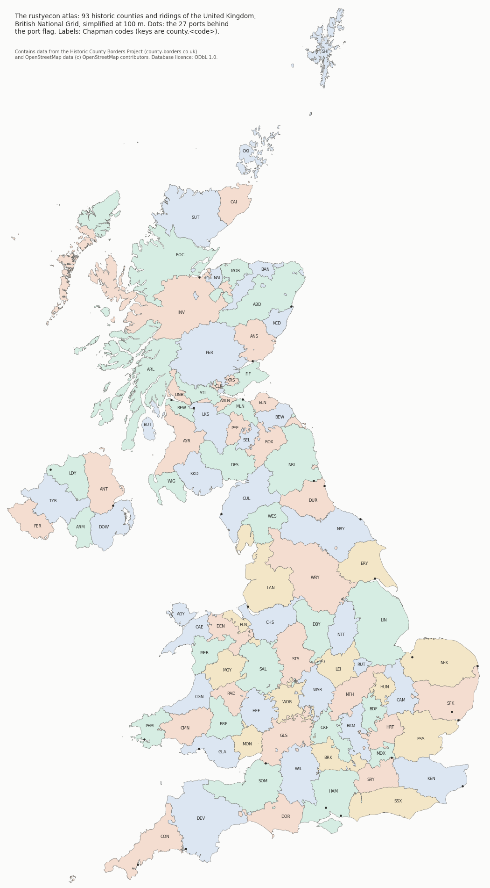

# The atlas

Written 2026-09-27, commit D.1 on branch demo-world. This directory holds the map of the United
Kingdom's historic counties that the GUI's map (docs/GUI.md §6, G4) and the tape compiler
(`crates/worldgen`) read. It is a derivative database under ODbL 1.0: see `LICENSE` and
`ATTRIBUTION`. The code that builds and reads it is not under the ODbL.



## Files

| File | What it is |
|---|---|
| `gb.atlas.ron` | The atlas: sources, 93 regions with their measures and neighbours, 27 port sites, and the shapes as shared arcs. 891,105 bytes. |
| `preview.png` | The picture above, drawn by the build. |
| `build_atlas.py` | The build: pinned downloads to `gb.atlas.ron` and `preview.png`. |
| `requirements.txt` | The build's venv, every package pinned. |
| `LICENSE`, `ATTRIBUTION` | The ODbL, and the credit every copy and map must carry. |

The loader is `crates/worldgen/src/atlas.rs`: `Atlas::gb()` parses the bundled file (through
`include_str!`, so no file I/O), refuses it unless its digest is the recorded one, and checks it
whole. worldgen has no egui dependency, so the GUI and the compiler use the same loader.

## The regions

93 regions: 41 in England, 13 in Wales, 33 in Scotland and 6 in Northern Ireland.

- **Keys** are `county.<chapman>` in lower case (D7), such as `county.bdf`. Each region also
  carries its Chapman code, its Historic Counties Standard (HCS) codes and numbers, its name and
  its country.
- **Yorkshire** is split into its three ridings (ruling 3): `county.ery`, `county.nry` and
  `county.wry`, from Chapman's ERY, NRY and WRY, as D7 proposed. HCBP holds Yorkshire whole, so
  the lines between the ridings come from OpenStreetMap. The build nodes Yorkshire's border, its
  neighbours' borders and OSM's riding lines together, and gives each face to the riding it
  overlaps most, or else to the nearest. Areas: East Riding 3,057.4 km², North Riding 5,513.9
  km², West Riding 7,157.2 km². No sliver needed moving.
- **The City of York**, which HCS §4.5 places in Yorkshire but in no riding, lies outside OSM's
  three relations; the split gives it to the North Riding.
- **Ross and Cromarty** is one region, `county.roc`, with HCS codes CRT and RSS. HCS §4.4 treats
  Ross-shire and Cromartyshire as separate counties but allows them to be taken as one "for many
  practical purposes". Chapman has only ROC, and Cromartyshire is 64 scattered pieces inside
  Ross-shire, which would make a poor economic node.
- **Northern Ireland** is included. HCBP's UK file covers its six counties under the same
  permissive terms, so no other source was needed. The six share no border with Great Britain,
  so a world that covers Great Britain alone can leave them out without touching the rest.
- **Monmouthshire** is listed with Wales, as in Chapman's list. Eighteenth-century statutes
  often counted it with England. The atlas records the country only for grouping.
- **Detached parts** stay parts of their parent county, as HCBP Definition B assigns them. The
  drawn shapes have 1,181 parts and 187 holes.

## Measures

All measures are taken on the unsimplified coverage (HCBP's simplified release with the riding
split), in British National Grid metres.

- `area_km2` is planar in the grid. It differs from the WGS84 ellipsoidal area by at most 0.26%
  (Fermanagh, at the grid's western edge), with a median of 0.06%.
- `neighbours` lists every region sharing a border line (not just a point), with the length in
  kilometres. There are 201 pairs, from Derbyshire and Warwickshire's 2.8 km (through detached
  parts) to Aberdeenshire and Banffshire's 295.0 km. The list is symmetric, and each pair has at
  least one arc in the drawn shapes.
- `sea_km` is the length of border with the open sea: the outer edge of the whole coverage.
  Three enclosed gaps (2.18 km² in all) are not sea. `coastal` is `sea_km` of 1 km or more: 64
  regions are coastal, and the other 29 have none at all.
- `centroid` is the area centroid, which can lie outside the region. `label` is the pole of
  inaccessibility of the largest part, for placing a label.
- `port` is true for the 25 regions that hold one of the 27 port sites: major seaports c.
  1750-1850, an illustrative list chosen for the demo world from general knowledge, not from a
  source, with positions good to about a kilometre. Two are river ports whose county has no sea
  frontage: London (Middlesex) and Glasgow (Lanarkshire). The world design may use the flag or
  ignore it.

These are measures of the sources, not of any economy. If one ever enters a tape, its basis is
`Measured { source: "data/atlas <digest> (ODbL; OpenStreetMap contributors; Historic Counties
Trust)" }`, which `Atlas::basis_source()` writes (docs/GUI.md §6).

## The geometry and the format

The coverage is simplified with its topology kept (`shapely.coverage_simplify`, GEOS 3.13.1,
tolerance 100 m, coast included), rounded to a 1 m grid, and cut into arcs at every vertex where
more than two borders meet. Each arc is stored once, with the region on its left and the region,
or the sea, on its right. A region's shape lists its parts, each an exterior ring (anticlockwise)
and its holes (clockwise), and each ring is a list of arc references; `-1 - i` means arc `i`
reversed. Islands under 0.02 km² that border no other region (1,627 skerries) are left out of the
drawn shapes, though not out of the measures.

| | |
|---|---|
| Tolerance, grid | 100 m, 1 m |
| Arcs | 1,482 |
| Points stored (each shared border once) | 90,726 |
| Ring vertices (each shared border once per side) | 124,779 |
| Drawn area against measured area | at most 0.17% apart (Shetland), median 0.004% |
| File size | 891,105 bytes |

Why RON, and why arcs:

- RON is the workspace's format for tapes, and `ron` 0.8 with serde is already a dependency, so
  reading the atlas adds no crate. It is text, so a rebuild shows up in git as a diff, and the
  file carries its licence notice in its header. `.gitattributes` keeps it LF, so its digest is
  the same on every checkout.
- Arcs store each shared border once, which keeps the file small (a 1 m grid with delta-coded
  points) and makes neighbouring shapes agree exactly. The GUI can draw each border once (§6),
  thin, and tell a land border from the coast by whether `right` is set. Later, a channel
  between two neighbours can take its border length from `neighbours` and its line from the
  arcs, and sea routes can run between port sites.

At 250 m the atlas would have 52,596 ring vertices and 463 KB, and at 150 m 85,347 and 657 KB.
100 m keeps the most detail on the western coasts and islands while staying inside the budget
(at most 1.5 MB and 200,000 vertices).

## Sources and digests

| Source | Pin |
|---|---|
| HCBP UK Definition B, OSGB, simplified, release 2026-09-25: `https://www.county-borders.co.uk/UKDefinitionB_OSGB_Simplified.zip` | SHA-256 `764c2097b9fee7cf6e069edcf2db82becf5ac5e6ecbf00ffd15644009810d8dc` |
| OSM relations 13390974, 13391138 and 17849894, from Overpass with `[date:"2026-09-25T17:35:44Z"]` | SHA-256 `9103c50bbec1146467e957953031a3d77da12423a8114188b8486ae261a226b7` of the canonical extract |

HCBP republishes at the same URL. The design research (docs/GUI.md §6) used the release of
2026-09-24; the file served on 2026-09-27 is the release of 2026-09-25, which moves the borders of
Armagh with Tyrone and of Brecknockshire with Monmouthshire by under 0.002 km². The build pins the
2026-09-25 file and stops if the URL serves anything else. Overpass's reply carries the server's
own timestamp, so the OSM pin is on the canonical extract of the reply (relation, way ids, roles
and coordinates to 1e-7 degrees); the design research's download of 2026-09-25 and a fresh attic
query on 2026-09-27 give the same extract.

| Output | Digest |
|---|---|
| `gb.atlas.ron` | SHA-256 `797f3a2af5d660d1a7af60e627b33bdecde260282444171784ed6e549cfbeda6`; FNV-1a 64 `0xec2ee4100a483601` (`GB_ATLAS_FNV` in `crates/worldgen/src/atlas.rs`) |
| `preview.png` | SHA-256 `3a6040b9cba6f18880ff4b73ad683913da79ddb63c1b76e30670fbce989ea1c8` |

## Rebuilding

On WSL, with Python 3.10:

```sh
python3 -m venv /mnt/d/rustyecon-demo/venv-atlas
/mnt/d/rustyecon-demo/venv-atlas/bin/pip install -r data/atlas/requirements.txt
/mnt/d/rustyecon-demo/venv-atlas/bin/python data/atlas/build_atlas.py --cache /mnt/d/rustyecon-demo/atlas/cache
```

Without `--cache` the downloads go to `data/atlas/.cache/`, which git ignores. Once the cache
holds them the build runs offline, in about ten seconds, and two runs give identical bytes; a
build from an empty cache on 2026-09-27, fetching both sources, gave the same bytes too. It
stops if a pin does not match, if HCBP's counties are not the Standard's 92, if any coverage
(HCBP's, the regions', the simplified, the rounded) is invalid, if the ridings do not tile
Yorkshire or a rebuilt neighbour's area moves, if a port falls outside the county it names, or if
an arc is used twice from one side. It prints the numbers above. After a rebuild, record the new
FNV-1a 64 in `GB_ATLAS_FNV` and the digests here; `bundled_atlas_digest_is_recorded` fails until
then.

The loader's tests (`crates/worldgen/tests/atlas.rs`) check that the bundled atlas loads with its
recorded digest; that every region has geometry, inside the grid's extent, with its label point
inside it and its drawn area within 0.5% of its measured area; that the keys are unique, lower case
and `county.<chapman>`; that the adjacency is symmetric and equals the pairs the arcs join; the
counts by country; and the budget. A two-square fixture checks that the loader refuses a
duplicate, upper-case or malformed key, asymmetric or unknown neighbours, a region without
geometry, an arc reference out of range or on the wrong side, a ring that does not close, an arc
used twice, and a `coastal` or `port` flag its data does not back.
