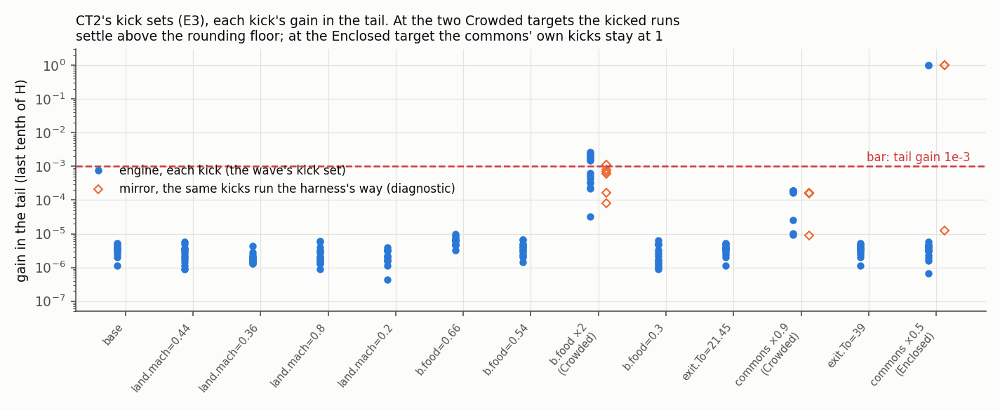

# PHASE2-S2: Phase 2 proper's second session, the families, the trap, the switch, a zero price (P2.4)

Dated 2026-10-01. Steps P2.4.1–P2.4.21 on branch `phase2-s2`, from `reboot` at `a483ed0`. The
brief was PHASE2-S1 §6: (A) O22's families on I1–I3 and the dial neighbourhood of C1, C2 and IW1;
(B) the subsistence trap's remedy, O100; (C) the type switch, O97; (D) a zero price markets can
hold, O96 and O101. Each of B–D was chosen by a mirror scan, registered before any code, built off
on every old tape (R1), passed E0 against its mirror, and ran its registered battery. Decisions
400–424 at registration and build, 425–430 at the result, 431–436 after the reviews.

| part | registered (frame, sha256) | built | scored | machinery |
|---|---|---|---|---|
| A | [families/SPEC.md](families/SPEC.md) `23bb3f3d…dd50` (P2.4.1) | no code | [results/families/](results/families/README.md) (P2.4.16) | [families-wave/](results/families-wave/README.md) |
| B | [trap/SPEC.md](trap/SPEC.md) `7a27f121…5bff` (P2.4.4) | [TRAP-RULES.md](TRAP-RULES.md) (P2.4.5) | [results/trap/](results/trap/README.md) (P2.4.17–18) | [p24-wave/](results/p24-wave/README.md) |
| C | [switch/SPEC.md](switch/SPEC.md) `ebf52cea…315f6f` (P2.4.7) | [SWITCH-RULES.md](SWITCH-RULES.md) (P2.4.8) | [results/switch/](results/switch/README.md), amendment A1 | the same |
| D | [free/SPEC.md](free/SPEC.md) `ef6c888f…3a04` (P2.4.10) | [FREE-RULES.md](FREE-RULES.md) (P2.4.11) | [results/free/](results/free/README.md), amendments A1 (E0) and A2 | the same |

**Conditions of every number below, unless its line says otherwise.** The many-market roles with
the session's three optional fields; C2m, 52 ticks a year, ρ 0, `Saturate`, planned assignment,
no government, no loop; tolerance 1e-3 in log; L as registered. Wave A ran on `markets` from
`66ae453` (sha256 `be3266ab…42e9`), the B–D waves on `markets` from `2b68736` (`aa97c626…88d4`),
WSL release, each built from a `git archive` export in its own target directory. "The mirror" is
each frame's registered model.

## 0. The verdict

| id | what it is | registered | engine | verdict after the reviews |
|---|---|---|---|---|
| I1–I3 | O22's families (stocks, joint2, joint4, basin, Hold, tilt 1, histories) | all 3,063 CONVERGED; I3's five map cells GO | the same, to the tick | **holds** (O109 closed) |
| C1, C2, IW1 | the dial neighbourhood, 17 settings × Tier 3 and 3S | C2, IW1 everywhere; C1 trapped in 18 runs at 7 settings | the same 18, to the tick | **holds** |
| C1P | C1 with participation at a rate (O100) | GO with margin | GO with margin | **GO; the margin is a class line, in sample** |
| C2P | C2 the same | GO with margin | GO with margin | **the same** |
| IS1 | IW1 with E's efficiencies, the migration rule (O97) | GO | GO (on A1, after the result) | **GO, a type with reserved tasks and no exit** |
| IS2 | IS1 pooled at its base, a control | reported | as predicted | control |
| IL1 | idle enclosed land at r = 0 under the free step (O96) | GO | GO | **GO** |
| CT2 | two types on one commons market under the free step (O101) | GO | LOCAL: 2 of 13 kick sets fail | **LOCAL, not as registered; its commons price unobserved** |

**In every scored run of the session's 16,637 jobs the class is the mirror's.** Wave A's 6,443 jobs
and the trap's 4,770 hold every scored line. The switch's 3,071 failed 236 lines as scored and 88
after its A1; the free step's 2,353 failed 27 and 4 after its A2. Both amendments were written
after the result, disclosed, and move no class, tick or verdict. One refutation criterion is met:
the free step's "a kick set that fails", at CT2. The reviews (§5) find every verdict holds as
registered, and narrow three readings:
- **"With margin" is decision 407's class line, met in sample**, not PLAN's gate (§6).
- **The remedies do not combine on one pop**: a pop on a commons market cannot pace, and CT2's
  pops keep the trap (7 of 40 joint4 runs); a pop with an exit cannot switch.
- **CT2's convergence is its real side's**: its commons price is not observed, and at the
  Enclosed target ends 1.3e-3 to 8.0e-3 in log above the oracle's r_o = r, by rule 419's tie.

## 1. What was built

Three optional fields, no new actor kind or market rule, each off when absent, every committed
tape's text, `tape_hash`, `world_id` and 2,000-tick stream unchanged on WSL and Windows, the pins
unmoved (gate `0x61f9c8529131ff17`, appb `0xe1fa082b26995867`, demo-gb `0xfad880fe08d06645`):
- **the exit's `pace`** (P2.4.5): the share of heads offering hours moves 1 − exp(−1.3/tpy) of its
  gap to the participation rule's each tick; the plots stay the rule's. C1P, C2P, C1PN. 10 tests.
- **the workers' `pool`** and the appended state `SwitchWorkers` (P2.4.8): a type's pool share
  moves toward the market that pays more by share(k·|g|) of the worse market's hours,
  g = ln(ε·w/w_i). IS1, IS2. 17 tests.
- **a good's `free`** and the exit's `market` (P2.4.11): p′ = p·e^(kx) + (c·p_ref)·expm1(kx),
  posting 0 where that is not positive, c 0.5, labour the reference. IL1, CT2. 18 tests.

Each test fails without its change; every mutant was killed. `gate.sh` (1,053 passed, 4 ignored)
and `gui.sh` (120) are green on WSL and Windows, last at P2.4.20 on P2.4.11's code, unchanged
since. Each rule passed E0 before any scored run (within 3.6e-14, 1.35e-13 and 6.1e-14; the free
step's partings at a price near 0 under its A1), and again on the scored binary, byte for byte.

## 2. The families wave and the dial map

**Wave A** ([results/families/README.md](results/families/README.md)): 32,411 lines, none failing.
O22's families converge on all three of P2.1's instances, each run to the mirror's tick. I3's
rate-by-buffer map is complete (eight of nine cells GO). I2's history measures its slowness, not
its recovery (O111).

**The dial neighbourhood** (Tier 3 at price rate, buffer and technique rate × 0.75, 0.9, 1.1 and
1.25, and tilt 0.05, 0.1, 0.25, 0.5 and 1; Tier 3S too at C1, C2 and IW1). A setting holds where
every run is CONVERGED or VACUOUS:

| instance | verdict at C2m | settings that hold | beyond the slice |
|---|---|---|---|
| IW1, C2, IS2 | GO, GO, control | all 17 | |
| IS1 | GO | all 17 | `rate.switch.*` × 0.75–1.25: all 4 |
| C1 (registered rule) | GO, a point result | 10 | |
| C1P, C2P | GO with margin | all 17 | tilt 2: 3 and 2 runs in the trap |
| IL1 | GO | all 17 | |
| CT2 | LOCAL | all 17 (its real side) | |

C1 loses seven settings to the subsistence trap (rate × 0.75 and × 0.9, buffer × 1.1 and × 1.25,
tilt 0.25, 0.5 and 1; 18 runs), each at the mirror's runaway tick; the pace restores all seven.
The map reads classes only: the base's kick set ran at each setting only at C1, C2 and IW1 (O112),
no liveness floor was read (§5), and at a free-able market the free step multiplies a positive
price's step by 1 + c·p_ref/p (about 21 at IL1, 24 at CT2), so its rate axis differs (O125).

## 3. The three scans and what the engine made of them

**B, the trap** ([trap/SPEC.md](trap/SPEC.md); 2,799 mirror runs a variant, 13 variants). The
mechanism: a machine-price shock makes the desks automate, the exit ties the wage to food's
price, hours fall to 0 for 132–208 ticks, and the machine desk's own input (a_kk 0.3) makes a zero
stock absorbing. Chosen: **participation at a rate**, 1.3 a year, which clears every scanned
family at C1 and C2 and keeps the point. Named alternative: home output sold, which clears the
neighbourhood but moves the point (an oracle addendum) and leaves basin 38 and 40 trapped.
Rejected: the food entrant (basin 42–44 trapped, Tier 2 37–69% slower) and a storable exit good
(locally unstable at C1, root 1.0009 and 1.0068). A held-out instance defined after the choice,
X4 (an exit worth 0.696 of the wage), converges under the pace in the mirror; it was not
registered for the engine. **On the engine: every line as registered**,
107,209 lines; C1P and C2P GO with margin; the controls trapped where registered; every CONVERGED
run on the mirror's tick and within 6.8e-14 in log of the oracle's point; no tick without hours.

**C, the switch** ([switch/SPEC.md](switch/SPEC.md)). Rejected: the step (DEAD at every pooled
rest), the replicator (a = 0 absorbs, a spurious rest), a static split (moves the point).
Chosen: **the migration rule** at 26 a year, which rests exactly at 1d's switch with both corners
open, 129/129 at every rate from 1.3 to 520 a year. **On the engine: IS1 GO**, a type crossing its
switch in the registered 61 of 129 runs, every class and tick the mirror's, all 26 kick sets.

**D, a zero price** ([free/SPEC.md](free/SPEC.md); 21,693 mirror runs). Rejected: `Saturate` and
the one-sided free state read literally, which run away (1/100 and 2/115 converge), and the snap
(stuck or orbiting at small rents). Chosen: **the free step**, c 0.5 in a window [0.3, 1]; its
rest set is complementary slackness, so no oracle addendum. **On the engine: IL1 GO**, its land
free on every tick at its point at three tick lengths; **CT2 LOCAL**.

## 4. The failures, and how they were read

The B–D waves' agent stopped at a usage limit after its scorers ran; on 2026-10-01 the record was
checked before it was read, with no run made again ([p24-wave/](results/p24-wave/README.md)).

- **The switch, 236 lines** ([A1](results/switch/registration-A1.md)). 148 pooled ends failed
  "within 1e-10 of a\*" because the scorer read a field printed to 7 digits; at the CSV's last
  row they are within 8.4e-13. The other 88 are the trained's walled ends above 1e-300, all under
  the conditions the scorer's reading 4 named before the wave (land.mach 0.8; `rate.*` or
  `rate.switch.*` × 0.75), each on its wall side. Reading 4 predicted them in kind, not line by
  line: 8 more of the trained's lines under those conditions passed. They stand.
- **The free step, 27 lines** ([A2](results/free/registration-A2.md)). 8 end regimes were scored
  against the mirror's bids-against-offers readout, which the registration's own OF6 rules out in
  exactly those 8 runs. 3 runaway ticks were registered on the undisplaced genesis, not the
  harness's reference (O107 again); on it the mirror gives the engine's tick in 8 of 8. 12 end D̂
  above 1e-9 are runs at a slow dial root, still falling at the registered root.
- **Four lines stand, all CT2's**: its kick sets at `b.food=1.2@dated` (Crowded, r_o 0.0118·r) and
  `exit.To=9.75@dated` (Enclosed), its verdict, and one switch count. At the Enclosed target the
  commons' own two kicks stay at gain 1.0; at b.food × 2 the kicked runs settle 1.5e-12 to 2.7e-12
  in log from the unkicked run and stay, the same at three horizons. The free mirror, run the
  harness's way, does both; the registration's prediction from its largest root saw neither. The
  switch count parts where a pop's coin cannot cover its commons bid: the engine's budget chain
  cuts the bid, the mirror spends coin it lacks (12 of CT2's 1,225 runs; decision 429).

## 5. What the reviews found, and the corrected verdict

Two reviews ran after P2.4.19. **Both find the verdicts hold as registered**; neither changes a
class.

**Measurement.** Fresh builds give both waves' binaries byte for byte; 297 B–D jobs and 213 of
wave A's rerun byte for byte (17 on Windows); an independent key rescored every run; the pipeline
regenerates from the D: archive; each SPEC was committed once, each scorer before its wave. Five
minors, answered at P2.4.20: reading 4 predicted the 88 in kind (§4); B's and C's E0 rerun on the
scored binary, byte for byte; the runner's start and end records kept with their times (the
archive's are the copy's); "every table byte for byte" holds up to CRLF→LF; the failing kick
tails (1.5–2.7e-12 in log) sit at the scale of CT2's mode A gap (5.6e-13 engine, 1.9e-12 mirror).

**Fidelity.** The code does what each spec says (the pace is not a positivity floor in disguise;
the switch reads only posted prices; the free step binds only at the oracle's complementary
slackness). Four majors and two minors, each answered at P2.4.20–21:
- **The remedies do not combine** (decision 434). Scoped: O100's answer is for one plot-taking type
  on 398's rule, O97's for a type without an exit. A combined scan (the pace with a commons
  market; the switch with a priced exit, after 1e's addendum) is a prerequisite of the 1750-like
  registration (O123).
- **CT2's class does not include the commons price** (decision 433). Read from the archive in all
  1,225 CT2 runs ([ct2_ro.out](results/p24-wave/diag/ct2_ro.out)): within 8.5e-8 of the oracle's
  at the Crowded ends, but entering 1e-3 3.2–51 times later than the real side at b.food × 2
  (median 9.9), 1.1–1.25 times at commons × 0.9; at the Enclosed target never, 38 of 38 above r.
- **The Enclosed continuum is rule 419's tie, not the point** (decision 432, amending 427's
  reading). At r_o ≥ r̂ each pop bids min(G, T_o,i) whatever r_o, though selling its share at r_o
  and renting at r would pay. Unit 1e sets r_o = r. A kick reading that skipped the direction
  would certify the rule. Two paths: register r_o ≥ r as the model's own indeterminacy, or scan a
  pop rule that prices its share at its opportunity cost.
- **PLAN's gate is not met as decision 430 put it** (decision 431): no liveness floor (305 of 1,462
  paced dial runs have lowest baskets below 0.05 of the point), no target's kick at any dial, the
  pace's rate chosen on the slice it is judged on, the held-out X4 not run on the engine.
- Minors: the resting offset's source is the commons market's floating-point rest set, about
  ulp(D)/(ε·D) wide, 6e-13 in log at b.food × 2 for every c from 0.5 to 100, so a larger c cannot
  remove it (decision 435; O127); the paced hours and the rule's plots can use up to 1.12·N heads
  away from rest, renting land no one farms in the Enclosed regime (TRAP-RULES §2 note; O116).

**The corrected verdict.** C1P and C2P GO at C2m for one plot-taking type on 398's rule, their
margin the class line on the ±25%, tilt ≤ 1 slice, in sample. IS1 GO for a type with reserved
tasks and no exit. IL1 GO. CT2 LOCAL, its commons price unobserved and, at the Enclosed target,
above the oracle's. Wave A as registered.

## 6. What this means

**For PLAN's Phase 2 gate.** Of the four stationary configurations, I0, IW1 (now with IS1's
switch) and the open commons (C2, C2P, C1P; C1 a point result) are green at C2m; the 1750-like
instance is not built. "Green with margin, judged jointly", the absolute liveness floor and "a
stable region documented and referenced by the default dials" are not met: the slice is a class
line, in sample, for the paced roles. A11's kill condition is not triggered (no mode B failed).

**For the phase diagram.** The slice is its first map. The map proper needs each target's kick at
each dial (O112), a registered liveness floor and X4 on the engine; then PLAN's axes (dead, July's
axis and α; step ratio, buffers, stagger) from this neighbourhood out.

**For the 1750-like instance.** As a flow instance at C2m first, on these roles, loop-free; then
the goods chain's version at C2g by its own registration (decision 308), after storable running
goods (O51) and a funded steam county (O62). Its food-exit types on a shared commons and its
trained type under s(q) are exactly the combinations this session did not test. Before its
registration: the combined scan (434), the commons' Enclosed tie and price observables (432,
433), a kick measure scaled to each market's rest set (435), and the mirrors' budget cap (429).

**Recommendation.** Take C1P, C2P, IS1 and IL1 as GO and CT2 as LOCAL, as §5 narrows them, with
A1, A2 and decisions 425–436 open to veto. Next: your rulings on 427/432 and 431; one scan session
for the commons (the tie's two paths, r_o observed, the kick measure) and the combined scan; X4
and a liveness floor on the engine; then the 1750-like instance as a flow instance at C2m.

## 7. Open questions

1. **The commons at the Enclosed regime** (O101, O124; 432). Register r_o ≥ r as the model's
   indeterminacy, or a pop rule that prices its own share at its opportunity cost, with its
   chatter at r_o = r measured?
2. **How a kick set reads an inelastic market** (O127; 435). Scale the kick or the bar to the
   market's rest-set width, for any market whose demand barely moves with its price.
3. **The combined rules** (O100, O123; 434). Does the pace keep its margin on a commons market,
   and the switch its GO under the priced exit with 1e's addendum?
4. **The margin out of sample** (O116; 431). Does X4 hold on the engine, and what liveness floor
   should the gate read?
5. **Not tested:** ρ > 0, a government, 12 ticks a year as a default, targets' kicks at each dial
   (O112), a pooled type without reserved tasks or with ν ≠ 1 (O118), the 1750-like instance.
