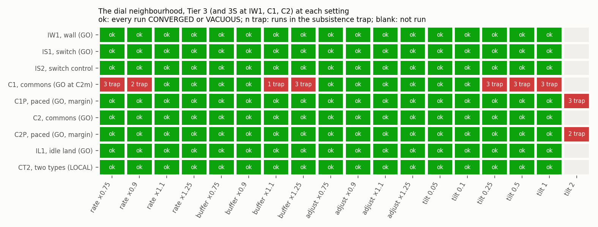

# Wave A on the engine: O22's families on I1–I3 and the dial neighbourhood, scored

Dated 2026-09-30. Step P2.4.16 on branch `phase2-s2`, label `run`. Scratch `D:/rustyecon-p24/run/`,
raw runs `D:/rustyecon-p24/runs/families/` (CSVs gzipped; `runs.jsonl.gz` beside them). It runs
wave A as registered at P2.4.1 ([registration.md](registration.md), frame
[../../families/SPEC.md](../../families/SPEC.md)) with the job list, gather script and scorer
committed before it at P2.4.2 ([../families-wave/](../families-wave/README.md)), and scores every
run against its registered mirror record line by line.

Conditions of every number here, unless its line says otherwise: C2m, 52 ticks a year, ρ 0,
`Saturate`, planned assignment; the registered L at every run (I1 144,000, I2 52,000, I3 484,000;
an I3 map cell 484,000/fr; IW1 22,000, C1 141,000, C2 142,000 at every dial setting); tolerance
1e-3 in log on each instance's observables. The binary is the P2.4.2 build, `markets` rebuilt in
WSL release from a `git archive` export of `66ae453` in its own target directory: sha256
`be3266ab…42e9`, the P2.3.12 binary's and the registration's, byte for byte
([../families-wave/BIN.sha256](../families-wave/BIN.sha256)).

## Verdict

**Every registered line holds.** The scorer read 32,411 lines: 31,190 pass, 1,221 are reported
(lowest baskets where the mirror's is at most 0.1, and the dial family's 51 base kick sets), and
**none fails, none is charged, none is missing**. No refutation criterion of SPEC §5.5 is met
(`../families-wave/score.out`: "refutations: none").

- **A1, O22's families on I1–I3: all 3,063 runs CONVERGED, as registered.** Stocks 120, joint2 180,
  joint4 120, basin 1,437, the battery under `Hold` 303 and with every tilt 1 303, and I3's five
  map cells 600 (mode A and 119 battery runs each). None of the three histories runs away. **All
  five of I3's unrun map cells are GO**, each of their 45 kick sets passing as the mirror's PL
  predicts.
- **A2, the dial neighbourhood: C2 and IW1 converge at every one of the 17 settings; C1 falls into
  the subsistence trap in exactly the registered 18 runs.** C2: 1,105 CONVERGED and its 34
  VACUOUS-by-construction runs VACUOUS (O103). IW1: 1,003 of 1,003 CONVERGED. C1: 1,121 CONVERGED
  and 18 DIVERGED, name for name the mirror's, each at the mirror's runaway tick on the harness's
  reference, to the tick.

**The engine is the mirror.** In all 6,339 runs with a class line:
- every class is the mirror's;
- every tick to tolerance of a CONVERGED run is the mirror's to the tick (6,465 runs; the 65
  history windows never in tolerance are "never" in both);
- dead ticks within one tick (6,543 of 6,564 exactly); the lowest baskets over Y\* within 2.4e-4
  where scored;
- the 18 trap runs' runaway ticks exactly the mirror's (287–391);
- every CONVERGED run ends within 4.1e-14 in log of its oracle point (the band: 1e-12).

## Prediction against result

| part | registered (SPEC §0, §4) | engine | |
|---|---|---|---|
| A1 stocks (I1 41, I2 29, I3 50) | all CONVERGED; median 470 / 1,884 / 530.5 ticks, slowest 586 / 2,685 / 801 | the same, to the tick | holds |
| A1 joint2 (60 each) | all CONVERGED; median 565.5 / 2,416 / 690.5 | the same | holds |
| A1 joint4 (40 each) | all CONVERGED; median 616.5 / 2,600.5 / 821 | the same | holds |
| A1 basin (412, 516, 509) | all CONVERGED; median 539 / 2,357.5 / 668, slowest 851 / 2,874 / 961 | the same | holds |
| A1 Hold (107, 77, 119) | all CONVERGED | the same, run for run | holds |
| A1 tilt 1 (107, 77, 119) | all CONVERGED; median 340 / 655 / 367 | the same | holds |
| A1 history, 81 windows of 1,500 ticks | no runaway; in tolerance at the window's end 81 / 16 / 81 (O111) | no runaway; 81 / 16 / 81, window for window; every window's ticks and dead ticks as the mirror's | holds |
| A1 I3's map cells (rate, buffer) = (0.5, 0.5), (0.5, 1), (0.5, 2), (1, 0.5), (1, 2) | GO each: mode A PASS; 119/119 CONVERGED; 9/9 kick sets pass | GO each: mode A PASS (largest gap 1.8e-15); 119/119, medians 844 / 675 / 542 / 1,511 / 366 ticks as the mirror's; 45/45 kick sets PASS, tail gain at most 3.4e-5 | holds |
| A2 C1, 17 settings × (43 + 24) | Tier 3S 24/24 everywhere; Tier 3 43/43 but at rate × 0.75 (3 trapped), × 0.9 (2), buffer × 1.1 (1), × 1.25 (3), tilt 0.25, 0.5, 1 (3 each) | the same classes, the same 18 runs (`p[mach]*0.5`, `JA(0.5)`, `JB(2)`), the same runaway ticks | holds |
| A2 C2, 17 × (43 + 24) | everything CONVERGED but `commons=62.4` at genesis and dated, VACUOUS (34) | the same | holds |
| A2 IW1, 17 × (39 + 20) | everything CONVERGED | the same | holds |
| A2 the 51 base kick sets | reported beside the mirror's PL (all below the bar) | all 51 PASS, tail gain at most 1.9e-5 (C1, buffer × 1.25) | reported |

`families.csv` has A1's sets with medians and slowest, `dial.csv` every (instance, setting, tier)
of A2 with the mirror's PL and the engine's base kick, `map_verdicts.csv` the five cells, and
`lines.csv.gz` every line (part, instance, set, group, run, what, registered, engine, band,
status). `fails.csv` is empty but for its header.

## What it says

- **O22 is answered on I1–I3 and closes O109.** The markets probe's unrun families converge at
  all three of P2.1's instances, as the mirror said, and I3's rate-by-buffer map is now complete:
  eight of its nine cells are GO (the base and two at P2.1, five here), and the ninth, every rate
  × 2 with every buffer × 0.5, is P2.1's NO-GO (MARKETS `families.csv`). I2 remains slow (its median family run takes 1,900 to
  2,600 ticks, five times I1's) and its history measures that slowness, not recovery (O111): 65 of
  81 windows end out of tolerance, in the engine as in the mirror.
- **The dial neighbourhood's first slice** (PHASE2-S1 §6): C2 and IW1 hold their Tier 3 and 3S
  at every ±10% and ±25% move of every price rate, buffer and technique rate and at every tilt
  from 0.05 to 1. C1 does not: its stable region at C2m ends within 10% on two dials (slower
  prices, faster buffers) and at a tilt of 0.25. It falls into the subsistence trap each time
  through the same three runs, `p[mach]*0.5`, `JA(0.5)` and `JB(2)`, running away after 287–391
  ticks; Tier 3S never. The technique rate (`adjust.*`) moves nothing at either commons
  instance. This is PHASE2-S1's point result made a map; the trap's remedy's wave (P2.4.17) runs
  the same slice on the paced C1P and C2P, and the same 731 C1 runs again as its control.
  The map across the session's nine instances is in "The dial-neighbourhood map" below.

## Disclosures

- **The job order.** The job list is in the registered priority, stocks first, and by cost within
  a set, not by cost overall; the 45 kick sets of I3's map cells ran together and held 45 of the
  46 slots for about 40 minutes. The wave took 73 minutes (16:30–17:43 UTC), 200,907 job-seconds.
- **Before the wave**: the load check of every job at 8 ticks (`../families-wave/PREFLIGHT.md`,
  P2.4.3). No other run of the wave's.
- **The history runs' own class** reads DEAD in the harness's summary (each is one run whose target
  moves every 1,500 ticks, and its dead ticks pass the harness's share); as at P2.3, the family is
  read window by window, and the summary's class is not a registered line.
- Nothing in the scorer, the job list or the harness changed after the registration or during the
  wave. The raw runs were archived with their CSVs gzipped and `gather.py` regenerates
  `runs.jsonl` from the archive byte for byte (sha256 `fe868f22…8cfd`); the WSL copy was then
  deleted.

## The dial-neighbourhood map across the session's instances (P2.4.18, 2026-10-01)

Wave A ran the first slice of the phase diagram on C1, C2 and IW1. The B–D waves ran the same
17 settings on the session's new instances: Tier 3 of C1P and C2P (the trap's E10), of IS1 and
IS2 (the switch's E7 and E8) and of IL1 and CT2 (the free step's E4), and IS1's and IS2's switch
rate alone and C1P's and C2P's every tilt 2 beside them. `../p24-wave/dialmap.py` tabulates their
classes from the two waves' gathered runs (`dialmap.csv`; `../p24-wave/dialmap.out`). A setting
holds where every Tier-3 run (and Tier-3S run, at C1, C2 and IW1) is CONVERGED or VACUOUS, the
verdict battery's Tier-3 criterion at that setting.

| instance | its verdict at C2m | the 17 settings that hold | beyond them |
|---|---|---|---|
| IW1, the wall | GO (P2.3) | all 17 | |
| IS1, the type switch | GO | all 17 | `rate.switch.*` × 0.75–1.25: all 4 |
| IS2, its control | reported | all 17 | |
| C1, the open commons, full | GO, a point result (P2.3) | 10: not rate × 0.75 or × 0.9, buffer × 1.1 or × 1.25, tilt 0.25, 0.5 or 1 (18 runs in the trap) | |
| C1P, C1 paced | GO with margin | all 17 | tilt 2: 3 runs in the trap |
| C2, the open commons, room | GO (P2.3) | all 17 | |
| C2P, C2 paced | GO with margin | all 17 | tilt 2: 2 runs in the trap |
| IL1, idle land at r = 0 | GO | all 17 | |
| CT2, two types on one commons | LOCAL (two kick sets) | all 17 | |

- **Which dial moves keep each instance GO.** Every ±10% and ±25% move of the price rates, the
  buffers and the technique rates, and every tilt from 0.05 to 1, keeps Tier 3 converging at
  eight of the nine instances. C1 alone loses it, to the subsistence trap, at seven settings; the
  pace (C1P) restores all seven and keeps C2's. The edge of the paced instances lies beyond the
  slice, at a tilt of 2. CT2's dial runs all converge, but its verdict at C2m is LOCAL for its kick
  sets, so no dial makes it GO.
- **Lines that fail at a setting without a class failing**: IS1's walled end above 1e-300 at
  `rate.*` and `rate.switch.*` × 0.75 and at land.mach 0.8 everywhere (the scorer's reading 4,
  declared before the wave); CT2's `b.food=1.2` end D̂ above 1e-9 at six settings and its regime
  readout at four (both re-read by the free step's A2, after the result); CT2's `JB(2)` at tilt 1,
  one switch count, which stands ([../free/README.md](../free/README.md)).
- **What the map does not cover.** Only the base's kick set ran at each setting, and only at C1,
  C2 and IW1 (51, all PASS): a setting that made a cost target slowly unstable would show here as
  CONVERGED (O112). The 1750-like instance is not in it.
