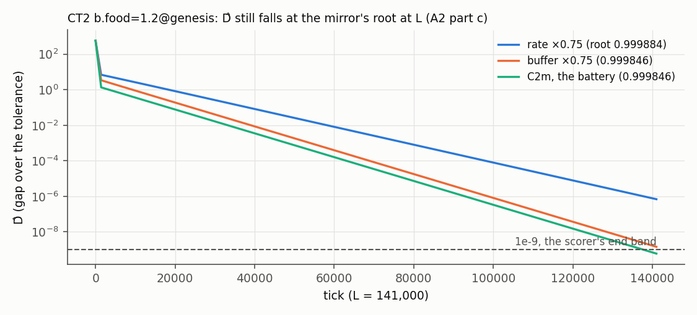

# A zero price markets can hold on the engine: IL1 and CT2, scored

Dated 2026-10-01. Steps P2.4.17 (the wave's record) and P2.4.18 (amendment A2) on branch
`phase2-s2`, label `run`. Raw runs `D:/rustyecon-p24/runs/bcd/free/` (CSVs gzipped). It scores the
free step's wave as registered at P2.4.10 ([registration.md](registration.md), frame
[../../free/SPEC.md](../../free/SPEC.md) §9–§10, sha256 `ef6c888f…3a04`) with A1 (E0 only, P2.4.12),
built at P2.4.11 ([../../FREE-RULES.md](../../FREE-RULES.md)) with E0–E2 at P2.4.13 ([e0.md](e0.md))
and decision 424, with the job list, gather script and scorer committed before it at P2.4.14
([../p24-wave/](../p24-wave/README.md); decision 311).

Conditions of every number here, unless its line says otherwise: I1's economy (MARKETS-SPEC §1.2)
with the free step at c 0.5, labour's price the reference; IL1 one priced type on idle enclosed
land at r = 0, CT2 two types on one commons traded on a market; C2m, 52 ticks a year, ρ 0,
`Saturate`, planned assignment; the registered L (IL1 56,000, CT2 141,000; 13,000 and 26,000 at
12 a year, 390,000 and 1,114,000 at 365); tolerance 1e-3 in log. The binary is the B–D waves',
sha256 `aa97c626…88d4` ([../p24-wave/BIN.sha256](../p24-wave/BIN.sha256)).

## Verdict

**IL1 is GO, as registered. CT2 is LOCAL, against a registered GO: two of its 13 kick sets fail,
and with them a refutation criterion of SPEC §10 is met.** Every run of both instances converges
where the mirror said, at the oracle's point, with its free-able market free where the oracle's
price is 0 and priced where it is positive.

| | mode A | Tier 1 | Tier 2 | Tier 3 (10·L) | Tier 3S (10·L) | kicks | the dial family (17 settings) | verdict |
|---|---|---|---|---|---|---|---|---|
| IL1 | PASS, 3.3e-16; land free on every tick | 25/25 | 33/33 + 4 V | 36/36 + 2 V (the same) | 22/22 (22/22) | 13/13 | 612/612 + 34 V | **GO** (registered GO) |
| CT2 | PASS, 5.6e-16; the commons free on every tick | 30/30 | 40/40 + 2 V | 41/41 + 2 V (the same) | 24/24 (24/24) | **11/13** | 697/697 + 34 V | **LOCAL** (registered GO) |

The scorer read 42,231 lines: 33,527 pass, 8,677 are reported, 27 fail
(`../p24-wave/score-free.out`). Its refutation list: "12 CONVERGED runs resting off the oracle's
point" and "2 kick sets failing". **Amendment A2** ([registration-A2.md](registration-A2.md),
written after the result and disclosed as such) re-reads 23 of the 27, of three kinds, and all 23
pass on it (`amended.csv`; `../p24-wave/amend.out`):

- **(a) 8 end regimes** registered as the mirror's bids-against-offers readout, which the
  registration's own OF6 (O129) names as wrong in exactly these 8 runs (CT2's `b.food=1.2` at
  buffer × 0.75, × 0.9 and rate × 1.1, × 1.25). Read against the oracle's regime, as §9.2 states
  it, the engine's `Crowded` is right in all 8.
- **(b) 3 runaway ticks** registered on the undisplaced genesis prices, not on the harness's
  reference that §9.3 names (O107 again). The mirror, unedited, with the bound on the displaced
  prices gives the engine's tick in all 8 trap runs, to the tick (`../p24-wave/diag/runaway_ref.out`).
- **(c) 12 end D̂ above 1e-9**, CT2's `b.food=1.2` at six dial settings, 1.0e-9 to 6.9e-7. Each
  falls on every one of its last 40 CSV rows at the mirror's registered root for that dial, within
  2e-7, and ends where that root takes it from its tolerance tick, within 3%. The registration's
  own roots put these ends above 1e-9 at L. They are converging, not resting off the point, and the
  refutation line reads none on A2. 

**4 lines stand**: CT2's two kick sets, its verdict, and one switch count.

**The engine is the mirror, but at one corner.** In all 2,313 scored runs every class is the
mirror's; 2,208 of the 2,211 CONVERGED runs reach tolerance at the mirror's tick, and the other
three within 7% (CT2's `JA(0.5)` at tilt 1, 648 against 649; IL1's `s[care]=0.2` and `=0.05` at 12
a year, 296 against 318 and 311 against 312). Every CONVERGED run but the 12 slow ones ends within
7.3e-13 in log of its oracle point. The corner: in 12 of CT2's 1,225 runs (5 at tilt 0.5 and 1,
7 of joint4) a pop's coin cannot cover its commons bid, the engine's budget chain cuts the bid
(FREE-RULES), and the mirror lets the coin fall. There the paths part (at tilt 1 `JB(2)`, at tick
95, 2.5% in the commons' price); the classes, ticks and runaway ticks stay the mirror's, and one
readout line fails (`diag/ct2_switches.out`, `diag/budget_short.out`).

## The four lines that stand

| line | registered | engine | reading |
|---|---|---|---|
| CT2 kick set at `b.food=1.2@dated` (Crowded, r_o 0.0118·r) | decays, from PL 0.999846 (the bar e^-19.6) | 8 of 16 kicks' tail gains 1.5e-3 to 2.7e-3, above the bar 1e-3 | fails |
| CT2 kick set at `exit.To=9.75@dated` (Enclosed) | decays, from PL 0.987107 with the commons held | the commons' own two kicks gain exactly 1.0, tail and peak; the other 14 at most 5.7e-6 | fails |
| CT2's verdict | GO | LOCAL (Tiers 1–2 CONVERGED; the kick sets) | fails |
| CT2 `JB(2)` at tilt 1, free/priced switches | 2 (10% or 2) | 8 | fails |

**Diagnostics, run after the result, reported and not scored** (`../p24-wave/diag/`):
- **The Enclosed target's failing kicks are the continuum the registration names.** At r_o ≥ r
  the commons' price above r moves nothing real (SPEC §4.4, OF1, O124): a kick to it stays. The
  registration's PL held that price fixed; the harness kicks it. The free mirror, run the harness's
  way (`mirror_kick.out`), gives the same: gain 1.0 for both, and care's kick decays (1.3e-5).
- **At b.food × 2 the kicks do not decay to the rounding floor; they settle.** The engine's kick
  set again at H 70,500 and 282,000 gives every kick's tail gain identical to 7 digits to H
  141,000's (`kick_horizon.out`): the kicked runs come to rest up to 2.7e-12 in log from the unkicked
  one and stay there. The mirror, run the harness's way, does the same (tails 8.2e-5 to 1.1e-3, one
  above the bar), with peaks equal to the engine's to 4–5 digits. At the other Crowded target,
  commons × 0.9, the same thing passes the bar (tails 1.9e-4 in the engine, 1.6e-4 in the mirror).
  At the base and every free target the tails are at the usual floor, 4e-7 to 1e-5.
  

So the failure is the registration's prediction, made from the mirror's largest root, which sees
neither a neutral direction it held fixed nor a resting offset at a small rent; the mirror itself
would have failed the same two kick sets. The engine does not depart from the mirror there. But the
verdict rule asks every kick set to decay, and §10 counts a failing one as a refutation: **CT2 is
not GO as registered, and the free step's answer to O101 is open** (decisions 427–428).

## Prediction against result

| step | registered (SPEC §9.2) | engine | |
|---|---|---|---|
| E2 mode A | IL1 2.2e-13, CT2 8.9e-13 (52 a year; as D̂), free on every tick, at 12, 52, 365 | PASS at all three, gaps at most 3.9e-14; free on every tick | holds |
| E2 L | IL1 56,000, 13,000, 390,000; CT2 141,000, 26,000, 1,114,000 | the same, IL1 at 12 a year 20,000 (the probe's floor; decision 424 keeps 13,000, reported) | holds |
| E3 IL1's battery | 25/25, 33/33 + 4 V, 36/36 + 2 V; 3S 22/22; medians 281 / 334 / 516 | the same, to the tick | holds |
| E3 CT2's battery | 30/30, 40/40 + 2 V, 41/41 + 2 V; 3S 24/24; medians 306 / 354 / 512 | the same, to the tick | holds |
| E3 the kick sets | every bar passes at both | IL1 13/13 (tails at most 7.1e-6); CT2 11/13 | fails at CT2 |
| E3 the free-able market | ends at the oracle's price: 0 at free targets, positive at priced ones; first free tick within 2; switches within 10% or 2 | every CONVERGED run, both instances | holds |
| E4 the dial family | IL1 612/612 (+34 V), CT2 697/697 (+34 V); slowest 18,365 (CT2, rate × 0.75, b.food × 2) | the same; 18,365 | holds; 21 lines failed, 20 pass on A2, one stands |
| E5 stocks, joint2 | IL1 39/39, 60/60; CT2 41/41, 60/60 | the same | holds |
| E5 joint4 | IL1 39/40, CT2 33/40; the rest in the subsistence trap, at 254–276 | the same runs; 3 runaway ticks beyond 5% as registered, all 8 to the tick on the harness's reference (A2) | holds on A2 |
| E5 Tiers 1–2 at 12 and 365 a year | IL1 58/58 + 4 V each, CT2 70/70 + 2 V each | the same | holds |

The tables beside this file: `verdicts.csv`, `families.csv`, `dial.csv`, `kicks.csv`, `modea.csv`,
`runs.csv`, `lines.csv.gz`, `fails.csv` (the 27 lines as scored) and `amended.csv` (A2's 2,231
lines re-read).

## What it says

- **O96 is answered: idle enclosed land at r = 0 holds a zero price.** IL1's land market is free
  on every tick at its point, at every tick length and at all 17 dial settings, reopens to the
  wall's rent where land is scarce (`inst.land=260`), and every kick set decays. No pinned hash
  moved (E1, P2.4.11).
- **O101 is not answered as registered.** Two types share one commons traded on a market and every
  run converges to the oracle's point at every dial, but the kick sets at the Enclosed target and
  at the smallest Crowded rent fail. Both failures are of the measure against a property of the
  point (a continuum; a resting offset at a small price) that the mirror shares; neither is a
  divergence. Whether CT2 is GO is a reading of the verdict rule, and it is the user's.
- **The engine is a better account than the mirror at one corner**: where a pop's coin runs short
  the engine's budget chain cuts its commons bid, and the mirror lets it spend coin it has not got.

## Disclosures

- The wave, its cut-off and its checks: as [../trap/README.md](../trap/README.md) says; IL1 and CT2
  took 2,353 of its 10,194 jobs and 50,195 job-seconds.
- A2 was written after the result, to explain failed lines; it moves no class, tick or verdict. The
  committed scorer and its outputs stand as the record.
- **The diagnostics ran after the result**, none of them a registered run: four engine kick sets
  (CT2's `b.food=1.2@dated` and `exit.To=17.55@dated` at H 70,500 and 282,000) and one 4,001-tick
  engine run (`JB(2)` at tilt 1, every tick), all on the wave's binary; and the free mirror,
  copied from `D:/rustyecon-p24/scan-free/model`, checked against its `SHA256SUMS` and not edited.
