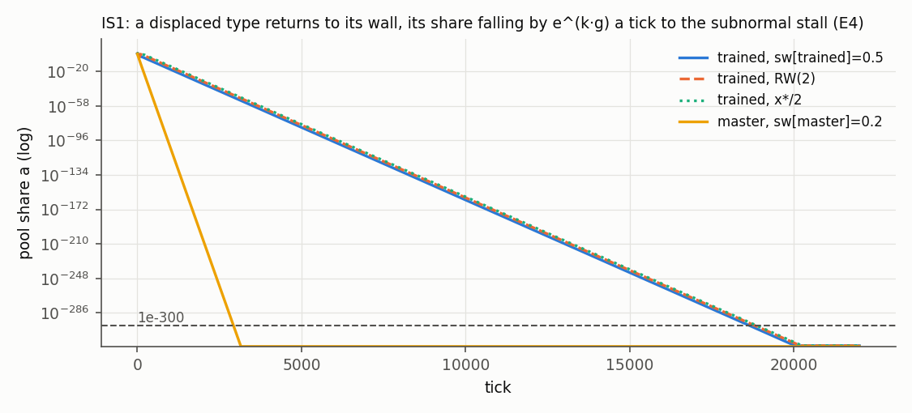

# The type switch at the wall on the engine: IS1 (and the control IS2), scored

Dated 2026-10-01. Steps P2.4.17 (the wave's record) and P2.4.18 (amendment A1) on branch
`phase2-s2`, label `run`. Raw runs `D:/rustyecon-p24/runs/bcd/switch/` (CSVs gzipped). It scores
the switch's wave as registered at P2.4.7 ([registration.md](registration.md), frame
[../../switch/SPEC.md](../../switch/SPEC.md) §7, sha256 `ebf52cea…315f6f`), built at P2.4.8
([../../SWITCH-RULES.md](../../SWITCH-RULES.md)) with E0–E2 at P2.4.9 ([e0.md](e0.md)), with the job
list, gather script and scorer committed before it at P2.4.14
([../p24-wave/](../p24-wave/README.md); decision 311).

Conditions of every number here, unless its line says otherwise: IW1's economy with unit 1d's E
efficiencies (trained 1.5, master 1.8), both switch pops at `rate.switch` 26 a year; C2m, 52 ticks
a year, ρ 0, `Saturate`, planned assignment; L from the engine's elasticity probe (IS1 22,000,
IS2 24,000; 20,000 at 12 a year, 164,000 and 183,000 at 365); tolerance 1e-3 in log on 20
observables. The binary is the B–D waves', sha256 `aa97c626…88d4`
([../p24-wave/BIN.sha256](../p24-wave/BIN.sha256)).

## Verdict

**IS1 is GO, as registered. 236 lines failed as scored; after amendment A1, 88 fail, all under the
conditions the scorer's reading 4 named before the wave; no refutation criterion is met.**

| | mode A | Tier 1 | Tier 2 | Tier 3 (10·L) | Tier 3S (10·L) | kicks | the neighbourhood (17 × 41) | the switch's rate (4 × 41) | verdict |
|---|---|---|---|---|---|---|---|---|---|
| IS1 | PASS, 3.3e-16 | 28/28 | 40/40 | 41/41 (41/41) | 20/20 (20/20) | 13/13 | 697/697 | 164/164 | **GO** (registered GO) |
| IS2, reported | PASS, 1.1e-15 | 28/28 | 40/40 | 41/41 (41/41) | 20/20 (20/20) | 13/13 | 697/697 | not run | control |

The scorer read 65,081 lines: 31,360 pass, 33,485 are reported (IS2's, as registered, and the
readouts registered as reported) and 236 fail (`../p24-wave/score-switch.out`). None is a class, a
tick to tolerance or a verdict. All 236 are E5's end of a switch pop's share:

- **148: a pooled pop's end, "at a\* within 1e-10 relative".** The scorer read the share from the
  harness's `stats.tsv`, which prints 7 significant digits; its last digit is worth up to 1.2e-7
  of a\*. So every scored pooled line failed, and the refutation line printed "148 pooled pops more
  than 1e-9 relative from a\*". **Amendment A1** ([registration-A1.md](registration-A1.md), written
  after the result and disclosed as such) reads the same share at the run's CSV's last row, its last
  tick at full precision: all 148 are within 8.4e-13 of a\* (at 52 a year within 1.3e-13), and the
  refutation reads none (`amended.csv`; `../p24-wave/amend.out`).
- **88: a walled pop's end, "0.0 if it never pooled, else at most 1e-300".** These stand. The
  scorer's reading 4, declared before the wave, expected them from the registration's own full-L
  run: a share that decays by e^(k·g) a tick does not reach the subnormal stall by L where the gap
  is small or the switch slow. Every one is the trained: land.mach 0.8 (gap −0.053) at every one
  of the 17 + 4 settings and in the battery (1.4–1.6e-252; the registration's own run 1.47e-252;
  at rate × 0.9 and × 1.1, 2.7e-227 and 8.1e-278), and every target at `rate.*` × 0.75 and at
  `rate.switch.*` × 0.75 (up to 2.2e-189 and 4.8e-190). Each is on its wall side, its share below
  1e-9 with its gap below 0: the refutation's reading holds in 88 of 88. *Corrected at P2.4.20*
  (the measurement review): reading 4 named the mechanism and the conditions (land.mach 0.8;
  `rate.*` or `rate.switch.*` × 0.75), not the lines. Under those conditions, among the pops that pooled, 8 more
  of the trained's walled-end lines passed (land.mach 0.2 at either rate × 0.75, ending at 2.4e-318 to
  6.7e-318; land.mach 0.8 at either rate × 1.25, 1.1e-315 to 4.7e-315), and all 21 of the
  master's; the 18 trained and 97 master lines whose pop never pooled pass too, ending at 0.0. So the failures were predicted in kind, not line by line.

**The engine is the mirror.** In all 2,993 scored runs of IS1 and IS2 every class is the mirror's
and every tick to tolerance of the CONVERGED ones is the mirror's to the tick; every CONVERGED run
ends within 1.1e-13 in log of its oracle point (end D̂ at most 1.03e-10).

## Prediction against result

| step | registered (SPEC §7) | engine | |
|---|---|---|---|
| E1 never pooled | IS1's 68 never-pooled runs are P2.3's engine IW1 runs | 68/68: class, ticks and peak D̂ as P2.3's; each pop's share never leaves 0.0 | holds |
| E2 mode A and L | PASS; L 22,000, 20,000, 164,000 (IS2 24,000, 20,000, 183,000) | PASS (3.3e-16, 4.4e-16, 4.4e-16); L the same, IS2's the same | holds |
| E3 the verdict | Tiers 1/2/3 28/40/41, 3S 20; medians (slowest) 338 (452), 446 (575), 561 (734), 3S 404 (558); the same at 10·L | the same, to the tick | holds |
| E4 kick sets | 13/13 at IS1 and IS2, tail gain at most 1e-3 | 26/26 PASS, at most 9.3e-6 | holds |
| E4 the envelope at the base | decay within 0.03 a year of 0.534 | 0.5338 | holds |
| E4 the envelope at tail.services 0.11 | 0.686, reported (README reading 6) | 0.571, measured from genesis with the shock | reported |
| E4 the corner rate | the share moves by exactly e^(k·g) a tick on its wall side | within 3.3e-16 relative, four every-tick runs | holds |
| E5 who pools | a type's share passes 1e-9 in 61 of 129 battery and 3S runs | the same 61 runs | holds |
| E5 pooled ends | at a\* within 1e-10 relative | 148 fail at 7 printed digits; at full precision (A1) within 8.4e-13 | holds on A1 |
| E5 walled ends | 0.0 if never pooled, else at most 1e-300 | 88 above 1e-300 (reading 4), all on the wall side | fails as registered |
| E6 the path | only JB(0.5) breaches the wall; troughs and dead ticks as the mirror's | the same | holds |
| E7 the families | neighbourhood 697/697, switch rate 164/164, 12 and 365 a year 68/68, Hold as Saturate, stocks 31, joint2 60, joint4 40, basin 516 | the same, run for run | holds |
| E8 IS2 (reported) | battery 109, 3S 20, 10·L 61, neighbourhood 697, 12/365/Hold 68 each, kicks 13/13 | the same | reported |
| E9 the points | the 50-digit solve's pooled flags exactly, a\* and switch distances within 1e-12; walled targets IW1's double for double | 48/48 at IS1 (a\* within 2.2e-16, distances 5.4e-16); IS2's 27 reported, all within the band | holds |

The tables beside this file: `verdicts.csv`, `families.csv` (every set and setting), `kicks.csv`,
`envelope.csv`, `points.csv`, `modea.csv`, `runs.csv`, `lines.csv.gz`, `fails.csv` (the 236
lines as scored) and `amended.csv` (A1's 1,142 lines re-read).

## What it says

- **O97 is answered for a type with reserved tasks and ε > 0.** A worker type that sells both
  reserved and pool hours moves between them by the migration rule and rests exactly at unit 1d's
  switch v_i = max(ε·v, ζ·ν·P_s): pooled where the pool pays more (the trained at four targets, the
  master at one), walled elsewhere, and in 61 of IS1's 129 battery and Tier-3S runs a type
  crosses. IS1 keeps
  IW1's GO, with the same speeds.
- **The dial neighbourhood holds**, every one of 697 + 164 runs. The walled share's slow decay
  at `rate.*` and `rate.switch.*` × 0.75 is O122's subnormal stall reached later, not a type
  left on the wrong side. 
- **The machinery's lesson** (A1): a band below the precision of the field the scorer reads
  cannot pass. The self-test could not show it, since an engine run to L was needed.

## Disclosures

- The wave, its cut-off and its checks: as [../trap/README.md](../trap/README.md) says; IS1 and IS2
  took 3,071 of its 10,194 jobs and 12,122 job-seconds.
- A1 was written after the result, to explain failed lines; it moves no class, tick or verdict.
  The committed scorer and its outputs stand as the record.

## After the reviews (P2.4.20, 2026-10-01)

Two reviews read this wave after P2.4.19; both find IS1's GO holds. The fidelity review checked the
rule against the code: `switch.rs` reads only the two posted wages, the basket's prices, its own
params and its share (R13); pooled ends have g exactly 0 (or −1.1e-16). Participation reads the
blend v = w_i + a′(ε·w − w_i), not 1d's max; the two agree at rest (decision 409's alternative).
Two corrections:

- **Reading 4 named conditions, not lines** (the measurement review; "Verdict" above).
- **The answer covers a type with reserved tasks and no exit.** A pop with a priced exit cannot
  switch (refused at load; O123). The 1750-like instance's trained type under s(q) needs a scan
  of the switch with the exit, after 1e's addendum for a walled type (O95, decision 377;
  decision 434).

The E0 of `e0.md` was run again on the scored binary, byte for byte (`../p24-wave/README.md`, "The
reviews' fix round").
