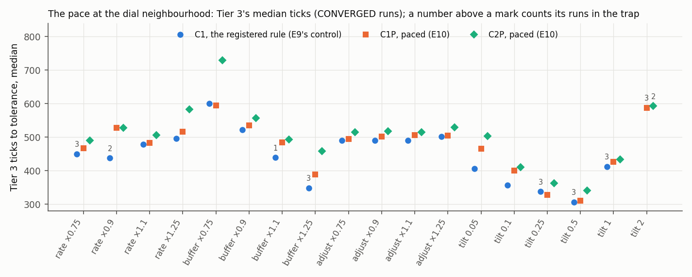

# The subsistence trap's remedy on the engine: C1P and C2P, scored

Dated 2026-10-01. Steps P2.4.17 (the wave's record) and P2.4.18 (this README) on branch
`phase2-s2`, label `run`. Scratch `D:/rustyecon-p24/run/`, raw runs
`D:/rustyecon-p24/runs/bcd/trap/` (CSVs gzipped; `runs.jsonl.gz` one level up). It scores the
trap's wave as registered at P2.4.4 ([registration.md](registration.md), frame
[../../trap/SPEC.md](../../trap/SPEC.md) §8–§9, sha256 `7a27f121…5bff`), built at P2.4.5
([../../TRAP-RULES.md](../../TRAP-RULES.md)) with E0–E2 at P2.4.6 ([e0.md](e0.md)), with the job
list, gather script and scorer committed before it at P2.4.14
([../p24-wave/](../p24-wave/README.md); decision 311).

Conditions of every number here, unless its line says otherwise: C2m, 52 ticks a year, ρ 0,
`Saturate`, planned assignment; the workers' exit paced at 1.3 a year (`exit.pace`); the
registered L (C1P 141,000, C2P 142,000; 26,000 and about 1.1 million at 12 and 365 a year);
tolerance 1e-3 in log. The binary is `markets` built in WSL release from a `git archive` export
of `2b68736`, sha256 `aa97c626…88d4`, the free E0's binary byte for byte, and again from a fresh
export on 2026-10-01 ([../p24-wave/BIN.sha256](../p24-wave/BIN.sha256)).

## Verdict

**C1P and C2P are GO with margin, as registered. Every scored line holds.** The scorer read
107,209 lines: 77,098 pass, 30,111 are reported, and **none fails, none is charged, none is
missing** (`../p24-wave/score-trap.out`: "refutations: none"). No amendment.

| | mode A (52 a year) | Tier 1 | Tier 2 | Tier 3 (10·L) | Tier 3S (10·L) | kicks | E10: 17 settings | verdict |
|---|---|---|---|---|---|---|---|---|
| C1P | PASS, 2.4e-15 | 30/30 | 42/42 | 43/43 (43/43) | 24/24 (24/24) | 13/13 | 731/731 | **GO with margin** (registered: the same) |
| C2P | PASS, 5.6e-16 | 30/30 | 38/38 + 4 V | 41/41 + 2 V (the same) | 24/24 (24/24) | 13/13 | 697/697 + 34 V | **GO with margin** (registered: the same) |

V: VACUOUS by construction (O103), as registered.

**The engine is the mirror.** In all 4,714 scored runs every class is the mirror's, and every tick
to tolerance of the 4,621 CONVERGED ones is the mirror's to the tick. Every CONVERGED run ends
within 6.8e-14 in log of its oracle point (end D̂ at most 6.8e-11; the band 1e-9). No tick of any
C1P or C2P run of E3–E8 and E10 has no hours offered.

## Prediction against result

| step | registered (SPEC §9) | engine | |
|---|---|---|---|
| E2 mode A | PASS at 52, 12 and 365 a year, 2.4e-15 / 2.1e-14 / 8.9e-16 (C1P) | PASS, 2.4e-15 / 3.6e-14 / 5.1e-15; C2P 5.6e-16 / 2.2e-16 / 6.7e-16; C1PN 2.2e-16 | holds |
| E2 L | C1P 141,000, 26,000, 1,113,000; C2P 142,000, 26,000, 1,116,000 | the same | holds |
| E2 kick sets (13 targets each) | every bar passes (largest root at most 0.990038) | 26/26 PASS, tail gain at most 1.6e-5; at 12 and 365 a year (reported) at most 7.8e-5 | holds |
| E3 the battery | as the table above; medians 319 / 369 / 516 (C1P), 326 / 387 / 524 (C2P) | the same; medians 319 / 369 / 515.5 and 326 / 387 / 524.5 | holds |
| E4 stocks (41), pace (5) | all CONVERGED; median 393, 392; pace 497, 505 | the same | holds |
| E5 joint2, joint4, basin | 60, 40, 430 each, all CONVERGED | the same, run for run | holds |
| E6 histories, land.mach and commons | 81/81 windows within tolerance | the same, window for window | holds |
| E7 Hold, tilt 1 | 115 (C2P 109 + 6 V) each | the same | holds |
| E8 Tiers 1–2 at 12 and 365 a year | 72 (C2P 68 + 4 V) each | the same | holds |
| E9 enclose | 4 each, CONVERGED | the same | holds |
| E9 C1PN's battery | 109 CONVERGED, 6 VACUOUS | the same | holds |
| E9 controls: C1 at the 17 settings | 18 in the trap (`p[mach]*0.5`, `JA(0.5)`, `JB(2)`) at 7 settings, 713 CONVERGED | the same 18, each at the registered runaway tick (287–391), on the harness's reference | holds |
| E9 controls: every tilt 2 | C1P 3 in the trap (308, 308, 314), C2P 2 (314, 305) | the same runs and ticks | holds |
| E10 the dial neighbourhood | every Tier-3 run CONVERGED (C2P's 34 VACUOUS) | the same; every setting's median and slowest the mirror's | holds |

The tables beside this file: `verdicts.csv`, `tiers.csv` (Tiers 1–3 and 3S, at L and 10·L),
`families.csv` (every set), `dial.csv` (E10 and the controls, per setting), `kicks.csv`,
`modea.csv`, `runs.csv` (every run, mirror and engine), `lines.csv.gz` (every line) and
`fails.csv` (its header only).

## What it says

- **O100 is answered: participation at a rate restores C1's margin without moving the point.**
  The registered C1 falls into the subsistence trap in 18 Tier-3 runs at 7 of the 17 settings (E9,
  again here). Paced, C1P converges in all 731 and C2P in all 697 non-vacuous runs, every one at
  the oracle's point (TR4's "with margin"). The basin, joint and history families, where the
  registered rule lost 89 + 77 basin runs, 24 joint runs and a land.mach history in the scan,
  converge in full. 
- **The trap remains beyond the edge** (O113): at every tilt 2, 3 of C1P's and 2 of C2P's Tier-3
  runs still collapse, as registered, now slowly and with hours never 0.
- **The pace costs little speed**: C1P's Tier-1/2/3 medians are 319/369/516 ticks against the
  registered rule's 319/372/508 (SPEC §0). At the 17 settings its Tier-3 medians lie in 311–594
  ticks, against the unpaced C1's 307–600, and it keeps every run.
- **R1 across the session's builds.** The trap's E9 reran wave A's 731 C1 runs on this binary (built
  after the trap, the switch and the free step); every one is wave A's (the P2.4.2 binary's) byte
  for byte, `summary.tsv`, `stats.tsv` and CSV (`../p24-wave/r1check.out`).
- **C1PN's L.** The engine's elasticity probe gives C1PN 148,000 (12 a year 28,000; 365 a year
  1,166,000) against the registered 141,000; its battery ran at the registered L, as registered,
  and its L line is reported, not scored.

## Disclosures

- **The wave.** One run for all three of the session's B–D waves: 10,194 jobs (the trap 4,770) on
  46 WSL threads, 17:43–18:43 UTC on 2026-09-30, 165,123 job-seconds (the trap 102,806). Before
  it, the load check of every job at 8 ticks (`../p24-wave/PREFLIGHT.md`, P2.4.15).
- **The run was cut off and resumed.** The agent that ran the wave stopped at a usage limit after
  the scorers ran and before this record was written. On 2026-10-01 the record was checked
  before it was read (`../p24-wave/verify/`): every job of the committed list ran exactly once,
  under its own name, inside the wave's hour, exit 0; a fresh build of `2b68736` in its own target
  directory gives the wave's binary byte for byte; the committed `gather.py` regenerates
  `runs.jsonl` byte for byte from the raw runs and again from the archive; the committed scorer
  regenerates its printout and every table byte for byte. No run was made again.
- Nothing in the scorer, the job list or the harness changed after the registration or during the
  wave. The raw runs were archived with their CSVs gzipped and the WSL copy deleted.

## After the reviews (P2.4.20, 2026-10-01)

Two reviews read this wave after P2.4.19; both find the verdict holds as registered. The fidelity
review narrows what it means:

- **"With margin" is decision 407's class line, met in sample.** Every Tier-3 run at the 17
  settings CONVERGED or VACUOUS. The pace's rate was chosen in the mirror on this same slice
  (decision 406). The scan's held-out instance with a dearer exit (X4) has not run on the engine.
  No liveness floor was applied: 305 of the 1,462 C1P and C2P dial runs have their lowest baskets
  below 0.05 of the point, 149 at 0 (`runs.csv`), and the most dead ticks in one run is 400. So
  this is not yet PLAN's "green with margin, judged jointly" (decision 431).
- **How the remedy works.** For a while it overrides the exit. In the mirror's former trap run
  (C1P `p[mach]*0.5` at rate × 0.9, which converges) the rule's F\* is exactly 0 on ticks 21–86,
  with the exit worth up to 2.66 times the wage, while 2–11% of heads still offer hours. That is a
  friction whose rate has no data behind it (O116). The scan's P5.2 and P13 keep hours positive
  and still trap, so the pace is not a positivity floor in disguise.
- **It covers one plot-taking type on decision 398's rule.** A pop on a commons market cannot pace
  (refused at load; FREE-SPEC §6.3), and the free step's CT2 keeps the trap in 7 of its 40 joint4
  runs (decision 434).
- **Away from rest the paced hours and the rule's plots can use more heads than N**, up to 1.12·N
  in the mirror. That is bookkeeping in the Commons and Crowded regimes, and it rents land no one
  farms in the Enclosed regime (TRAP-RULES §2, note of P2.4.20; O116).

The measurement review reproduced the record (`../p24-wave/README.md`, "The reviews' fix round").
"The committed scorer regenerates every table byte for byte" above holds up to CRLF→LF for the
tables. The E0 of `e0.md` was run again on the scored binary, byte for byte.
